# 情報科学専門学校ハンズオン

## 目次

1. [概要](#概要)
2. [カメラの接続と起動](#カメラの接続と起動)
3. [サンプルコードのフォーク](#サンプルコードのフォーク)
4. [isaaxアカウントの作成](#isaaxアカウントの作成)
5. [プロジェクトの作成](#プロジェクトの作成)
6. [デバイスの登録](#デバイスの登録)
7. [動作の確認](#動作の確認)
8. [ダッシュボードの基本](#ダッシュボードの基本)
9. [アプリケーションの更新](#アプリケーションの更新)
10. [QRコードの認識](#QRコードの認識)
11. [課題](#課題)

## 概要

複数のIoTデバイスの開発、管理について学びましょう。

## カメラの接続と起動

まずはじめにPicameraモジュールを接続しましょう。

ソケットの両端をつまんで引き上げ、フラットケーブルの青色のテープがUSBポート側を向くように接続します。引き上げたソケットを押し込んでケーブルが固定されれば完了です。Picameraの接続とSDカードの接続が完了したら、電源を投入しましょう。

本来はOS起動後にログインしてPicameraの有効化を行いますが、今回はあらかじめ設定されているため省きます。

## サンプルコードのフォーク

GitHubにまだログインしていない場合は、最初にログインを行なってください。

isaaxではデバイスにインストールするアプリケーションをGitリポジトリ(以下、リポジトリ)として管理します。

>リポジトリとは、ファイルやディレクトリの変更履歴を保持したプログラムファイルの集合です。Gitを使って開発する場合、大抵は1つのアプリケーションごとに1リポジトリ作成します(もちろん例外もあります)。

リポジトリはGitHub上に作成したものをisaaxと連携させて使います。GitHubはクラウド上にリポジトリの作成、共有が可能なWEBサービスです。個人のソースコード置き場から、オープンソースソフトウェアや企業での開発管理まで幅広く使われています。下記リンクをクリックしてサンプルコードのページを開きましょう(ブラウザはChromeを使ってください)。

[サンプルコード - study-picamera-examples](https://github.com/isaaxug/study-picamera-examples)

このページはisaaxugというアカウントが保有しているサンプルコードのリポジトリです。ソースコードそのものの中身やいつ・どのような変更を加えたのかなどを確認することができます。右上のForkボタンをクリックしましょう。

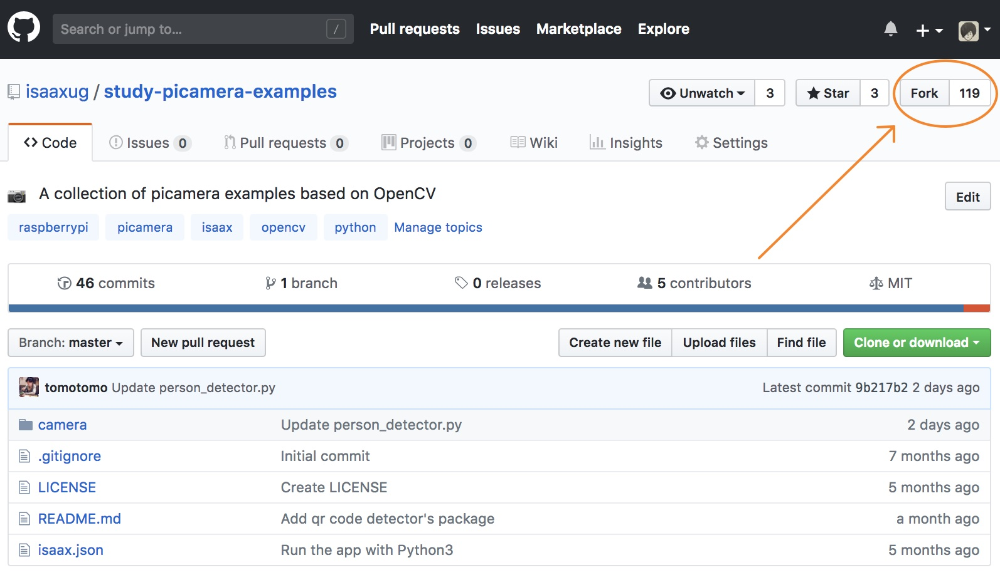

フォークとは、他の人が所有しているリポジトリを自分のアカウントにコピーすることです。フォークが正しく完了すると下図のように自分のアカウント名が表示されるとともにそのリポジトリがフォークであることを示すラベルがつきます。

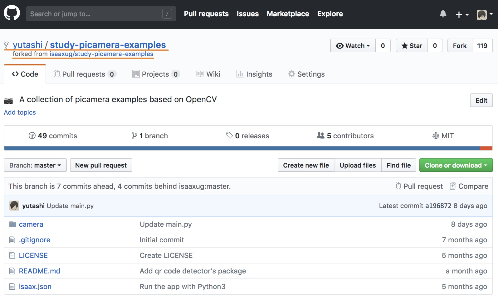

## isaaxアカウントの作成

GitHubのアカウントを使ってisaaxに登録しましょう。

[isaax - 公式ページ](https://isaax.io/)

isaaxの公式ページをブラウザで開き、右上の「登録する」ボタンをクリックします。次に、1番上のボタン「GitHub」をクリックして登録します。

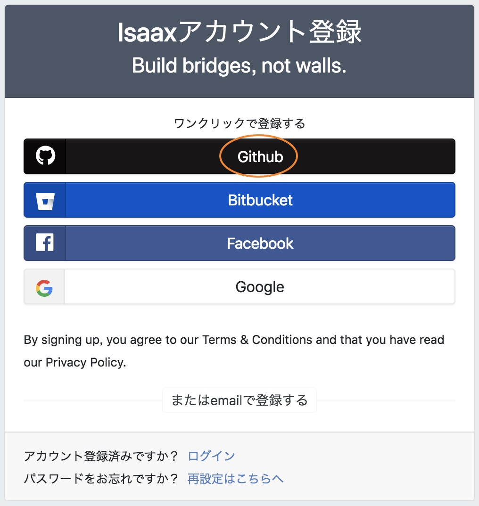

認証完了後、isaaxのダッシュボード(以下、ダッシュボード)が表示されればOKです。

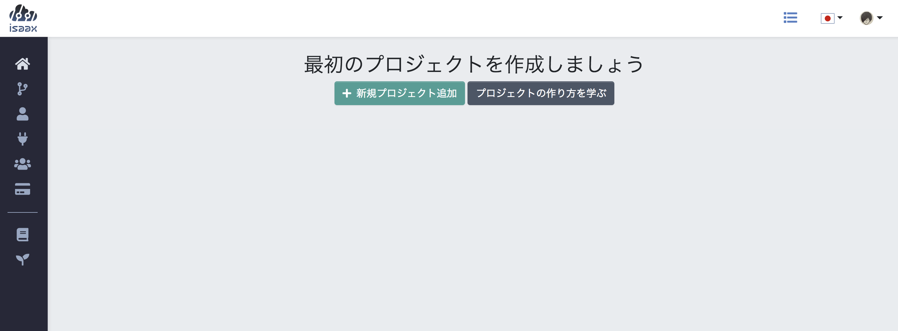

## プロジェクトの作成

フォークしたリポジトリを使ってisaaxに最初のプロジェクトを作成しましょう。ダッシュボードの「＋ 新規プロジェクト追加」ボタンをクリックします。

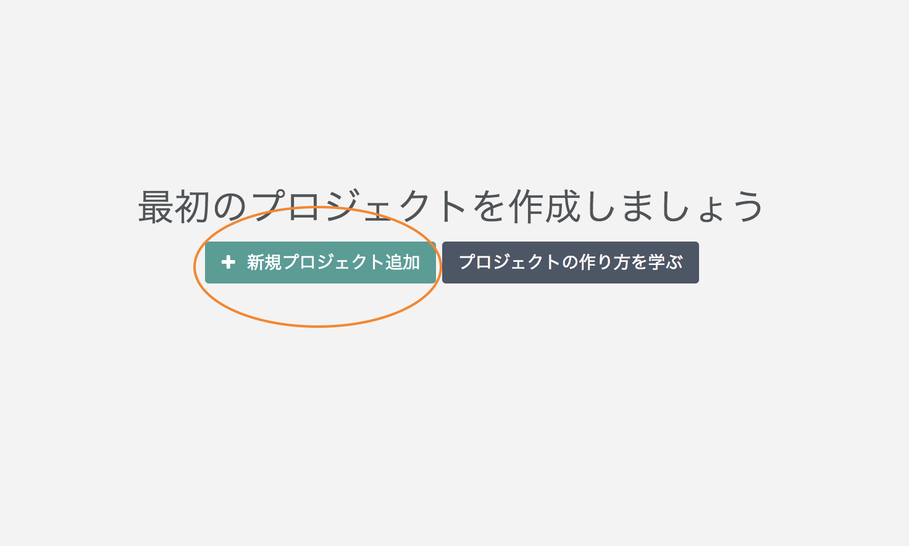

プロジェクトの設定を行うためのモーダルが開くので、下図のように情報を入力し「保存」ボタンをクリックします。

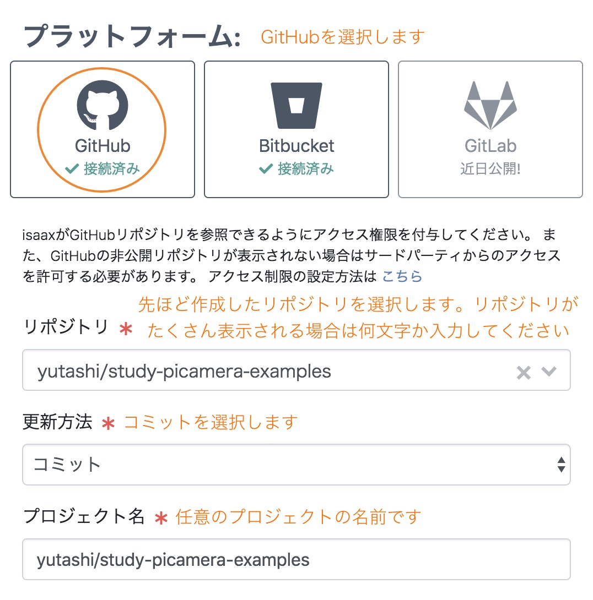

## デバイスの登録

作成したプロジェクトにデバイスを登録します。登録するにあたって、ラズベリーパイ側にはisaaxdというソフトウェアをインストールする必要があります。isaaxdは私たちがデバイスにインストールするアプリケーションの管理（起動、停止、ログの収集等）を担っています。

プロジェクトの作成後、下図のような画面が表示されます。プロジェクトトークンはデバイスにisaaxdをインストールする際に必要となります。インストールスクリプトはそのトークンを引数としてisaaxdのインストールをワンコマンド実行するためのスクリプトです。背景が黒い方の文字列をコピーしてください。

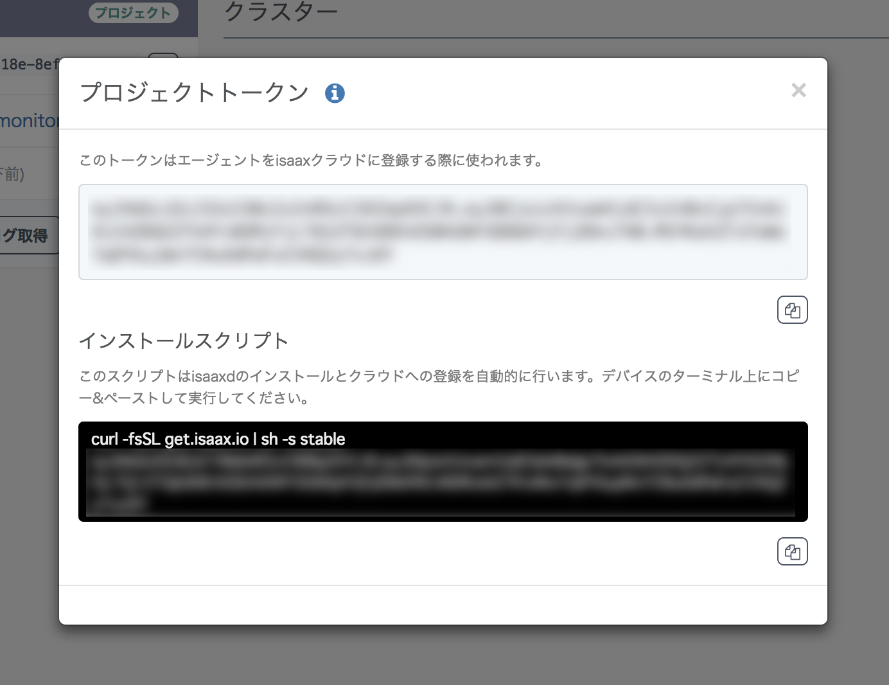

コピーしたコマンドはラズベリーパイ上で実行します。Puttyを使ってラズベリーパイにSSH接続しましょう。

Puttyを立ち上げ、「Host Name (or IP address)」の欄に自分のラズベリーパイのIPアドレスを入力します。

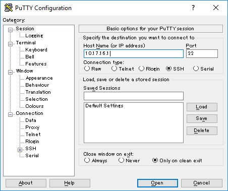

右下の「Open」をクリックしてセッションを開始します。黒いウィンドウが表示されます。それぞれ「login as: 」には`pi`、パスワードには`raspberry`を入力しましょう。ログインに成功すると次のような表示になります。

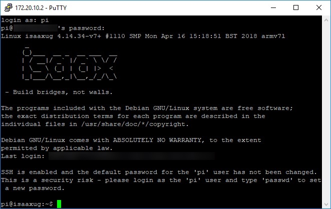

それでは、この節の最初にコピーしたインストールスクリプトを貼り付けて実行しましょう。

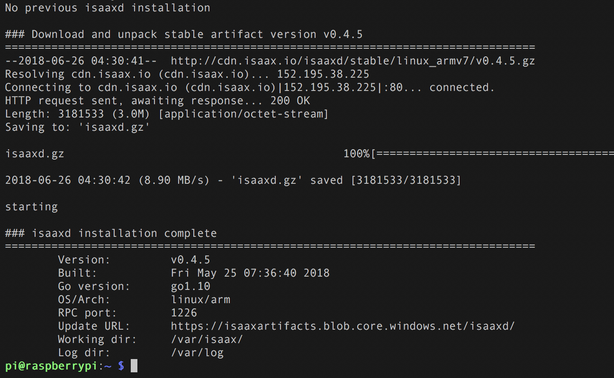

## 動作の確認

インストールが終了した時点でアプリケーションも登録されます。正しくインストールされているかどうか確認しましょう。

Chromeで新しいタブを開き`<ラズベリーパイのIPアドレス>:5000/video_feed`にアクセスしてください。カメラの映像がストリーミングされます。サンプルアプリケーションではラズベリーパイをWEBサーバとして起動し、Picameraモジュールから取得したフレームを連続したjpeg画像(Motion JPEG)として表示しています。ネットワーク帯域を圧迫しないためにフレームレートを3に下げていますが、30fpsで動作させることも可能です。

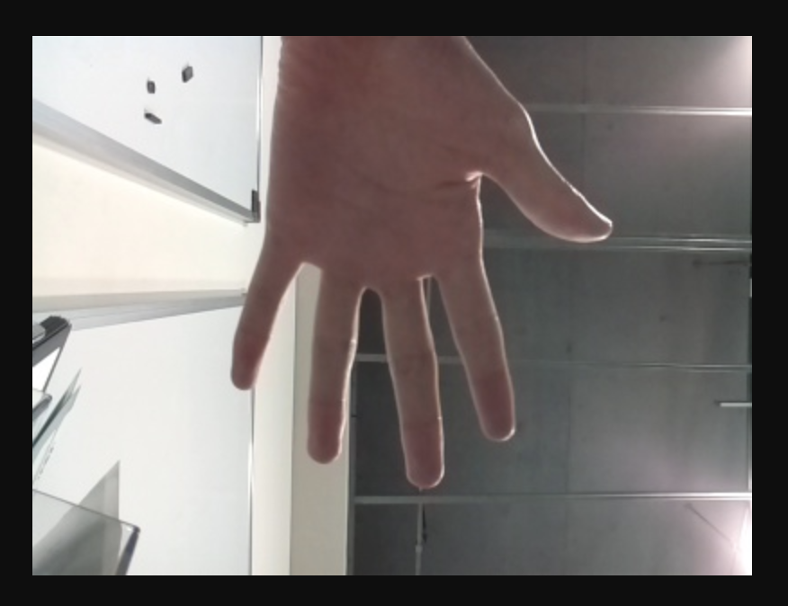

## ダッシュボードの基本

ダッシュボードに戻り、登録したデバイスの状態を確認しましょう。プロジェクトトークンのモーダルを閉じ、クラスターをクリックします。

> クラスターはプロジェクトに対して複数作成することができ、その下に紐付くデバイスをグループごとに分けるための機能です。この機能によって、開発中のデバイスと本番のデバイスを切り分けるといった応用的な操作が可能になります。
> 
> 特になにも操作せずにデバイスを登録した場合は下図のように「DEFAULT」というクラスターが自動的に作成され、そこにデバイスが紐付きます。

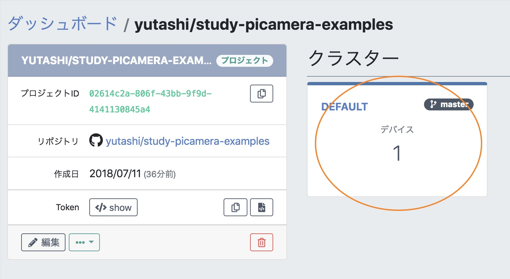

クラスターページを開くと「最近のデバイス」に先ほど登録したデバイスが表示されます。「バージョン」はインストールされているisaaxdのバージョンを、「リビジョン」はインストールされているアプリケーションのコミットID(Gitで作成した履歴ごとに付与されるID)をそれぞれ示しています。デバイスをクリックしましょう。

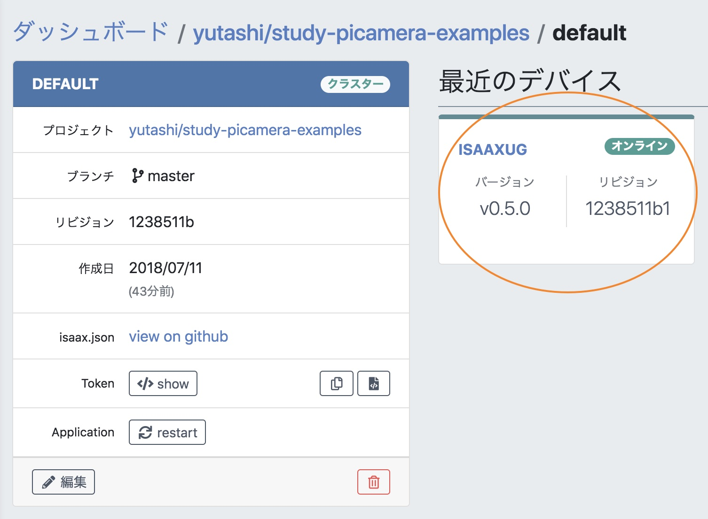

## アプリケーションの更新

他の画像処理エンジンを読み込むように変更して、
デバイスに変更を反映しましょう。

## QRコードの認識

QRコードを認識するように変更し、
複数のデバイスにプロジェクトを登録しましょう。

## 課題

### 課題1 表示色の変更

表示されているラベルの色を変更しましょう。

### 課題2 認識した箇所の描画

コメントアウトされた処理を外して
認識されたQRコードの位置を描画しましょう

### 課題3 認識したQRコードの数を表示

認識したQRコードの数